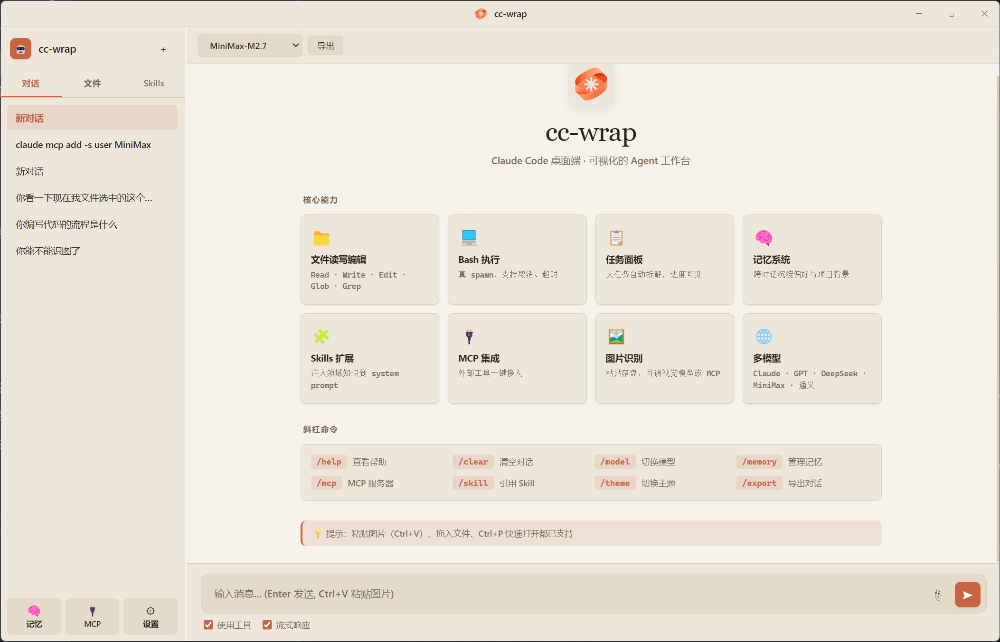

[中文](README.md)

# cc-wrap — AI Agent Desktop Workbench

> Open Source · Multi-Model · MCP Ecosystem · Built for Everyone

cc-wrap is a desktop wrapper for [Claude Code](https://claude.ai/code), combining the agent loop engine with a full graphical interface. No more terminal commands — manage file operations, command execution, code search, and tool extensions through a windowed UI.

**Deep optimization for global models**: Native support for DeepSeek V4, Qwen3.6, Kimi K2.6, Doubao, GLM-5.1, and more. Thinking/reasoning parameters auto-adapted per model — works out of the box.



---

## Key Advantages

### 🧠 One-Click Thinking Control, Auto-Adapts to 13+ Models

Every model uses a different "thinking" parameter format. cc-wrap detects the model name and injects the correct format automatically:

| Model | Parameter Format |
|-------|-----------------|
| Claude (Opus / Sonnet / Haiku) | `thinking.type` + `budget_tokens` |
| OpenAI o-series / GPT-5 | `reasoning_effort` |
| DeepSeek V4+ | `thinking.type` |
| DeepSeek V3 | `enable_thinking` |
| Qwen3 / QwQ | `enable_thinking` |
| Kimi K2.6 | `thinking.type` |
| Doubao | `thinking.type` + `budget_tokens` |
| Gemini 2.5 | `thinkingConfig.thinkingBudget` |
| Gemini 3.x | `thinkingConfig.thinkingLevel` |
| GLM-5.1 / MiMo | Always reasons, auto-skip |

Users just pick "Off / Low / Medium / High" — no need to know the underlying parameter differences.

### 🤖 Real Agent Loop, Not Just Chat

AI decides which tools to call, collaborating across multiple rounds to complete tasks.

- Send a request, AI autonomously calls Read / Write / Edit / Bash / Glob / Grep… until done
- Streaming output shows real-time thinking and operations
- Model-aware context compression (DeepSeek 500K, Gemini 200K, Claude 120K, default 80K)
- Stuck detection: consecutive failures trigger strategy hints, preventing infinite loops
- Smart tool result truncation to prevent context overflow
- **3-Level Message Queue**: now (immediate), next (next round), later (background)
- **Code Review 9 Stages**: Three-state verification (CONFIRMED/PLAUSIBLE/REFUTED)
- **Coordinator Multi-Worker**: Parallel execution of multiple subtasks

### 🌐 Switch Between World-Class Models Freely

One client for all major models:

| Model | Protocol |
|-------|----------|
| Claude (Opus 4.7 / Sonnet 4.6 / Haiku 4.5) | Anthropic Messages API |
| GPT-5.5 / GPT-5.4 / o3 / o4-mini | OpenAI Chat API |
| DeepSeek V4-Pro / V4-Flash / R1 | OpenAI compatible |
| Qwen3.6 / QwQ | OpenAI compatible |
| Kimi K2.6 | OpenAI compatible |
| Doubao-Seed-2.0 | OpenAI compatible |
| MiniMax M2.7 | OpenAI compatible |
| GLM-5.1 / GLM-Z1 | OpenAI compatible |
| Gemini 2.5 / 3.x | Google API |
| MiMo V2 | OpenAI compatible |

Auto-detects protocol: Anthropic format uses `/v1/messages` SSE, OpenAI format uses `/v1/chat/completions` streaming. Non-vision models auto-strip images to avoid 400 errors.

### 💡 Smart Tool Call Expansion

Not every tool call needs to be visible, but important ones must not be missed:

- **AskUserQuestion** — Auto-expands, shows only options, hides raw code
- **Write / Edit** — Auto-expands on completion, shows file changes
- **Agent sub-tasks** — Auto-expands, shows progress
- **Read / Grep / Bash etc.** — Stays collapsed, clean interface

### 🔌 MCP Ecosystem Plug-and-Play

Supports [Model Context Protocol](https://modelcontextprotocol.io/) in two transport modes:

- **stdio** — Local MCP servers (Node.js / Python), subprocess communication
- **HTTP/SSE** — Remote MCP services (e.g., Tavily Search), paste URL to connect

One-click MCP server installation with 5 transport modes: npm / pip / uvx / http / stdio.

**MCP Tool Validation**: Auto-validates input parameters (required params, type checking) to prevent call failures.

### 💻 Integrated Terminal Panel

`Ctrl+` ` to toggle, `node-pty` + `xterm.js`, VS Code-style experience:

- Real PTY process (cmd.exe / PowerShell / Git Bash)
- Drag to resize, process persists across close/reopen
- Run git, install packages, check logs without leaving the window

### 📋 Task Panel

AI automatically breaks down complex requests into subtasks with real-time progress.

- Status at a glance: completed / in progress / pending
- Click to toggle status, manual intervention supported

### 🧠 Memory System

AI automatically captures key information, persisting across conversations.

- Auto-extracts tech stack, preferences, project context
- Manual add / manage / delete memories
- Auto-injected into every conversation

### 🎯 Skills Extension

Inject domain knowledge into System Prompt for better AI understanding.

- Custom Skills (name + description + prompts + trigger keywords)
- Always-active or keyword-triggered activation
- Vendor onboarding: paste install steps, AI executes and registers the Skill
- **5-second cache**: Avoids repeated loading, auto-clears on save

---

## Why cc-wrap

| Dimension | cc-wrap | Terminal CLI | Web UI |
|-----------|---------|-------------|--------|
| Multi-model | ✅ 13+ models, one-click switch | ❌ Claude only | ⚠️ Single model |
| Thinking control | ✅ Auto-adapts per model | ❌ None | ⚠️ Limited |
| Chinese UI | ✅ Native Chinese + English | ❌ English terminal | ⚠️ Partial |
| MCP extensions | ✅ One-click install | ⚠️ Manual config | ❌ None |
| Integrated terminal | ✅ VS Code style | ✅ IS the terminal | ❌ None |
| File editor | ✅ Syntax highlight + preview | ❌ External editor | ⚠️ Limited |
| Permission mgmt | ✅ Visual modal | ⚠️ CLI confirm | ✅ |
| Memory persistence | ✅ Auto + manual | ❌ None | ⚠️ Limited |
| Offline use | ✅ Local | ✅ | ❌ |
| Open source | ✅ MIT | ✅ | ❌ |

---

## Full Feature List

| Feature | Description |
|---------|-------------|
| Agent loop | Multi-round tool calls, streaming output, model-aware compression, stuck detection |
| 3-Level message queue | now (immediate), next (next round), later (background tasks) |
| Code Review | 9-stage review, three-state verification (CONFIRMED/PLAUSIBLE/REFUTED) |
| Coordinator | Multi-worker parallel execution, task coordination |
| Thinking level | Auto-detect model, inject correct thinking/reasoning parameters, toolbar quick switch |
| File ops | Read / Write / Edit / Glob / Grep, supports text / .docx / .pdf / .xlsx / .csv, auto encoding detection |
| Bash execution | Non-blocking spawn, Git Bash / cmd auto-detect, cancel + timeout, dangerous command filtering |
| Multi-model | 13+ models, Anthropic + OpenAI + Google protocols, vision model auto-detect |
| MCP integration | stdio + HTTP/SSE dual mode, one-click install, auto-reconnect, input validation |
| Integrated terminal | Ctrl+` toggle, node-pty real terminal, draggable panel |
| Smart expansion | AskUserQuestion / Write / Edit auto-expand, others collapsed |
| Task panel | Auto task breakdown, progress tracking, state machine validation |
| Memory system | Auto-extract + manual management, cross-conversation persistence |
| Skills | Custom prompt injection, keyword / always-on activation modes, 5-second cache |
| File editor | Syntax highlighting, line numbers, find/replace, Markdown preview, file tree |
| Image recognition | Paste / drag auto-save, vision model + MCP tool dual path |
| Dual theme | Claude warm dark + soft beige light, adjustable font size |
| Bilingual | Instant language switching (Chinese / English, uses common terms like Base URL) |
| Token stats | Per-message ↑↓ display, `/cost` for full conversation details, contribution heatmap |
| Permission mgmt | Write / Edit / Bash modal confirmation, "always allow" persistence |
| System tray | Minimize to tray, right-click menu for new / settings / show / hide |
| Log viewer | Built-in log panel with search, clear, export, 5MB auto-rotation |
| Conversation mgmt | Create, switch, delete, export as Markdown |
| Slash commands | `/help` `/clear` `/model` `/memory` `/mcp` `/skill` `/theme` `/export` `/cost` etc. |
| Keyboard shortcuts | `Ctrl+P` open file, `Ctrl+S` save, `Esc` stop generation, `Ctrl+`` terminal |
| Failure retry | Red-highlight on API failure + one-click retry |

---

## Installation

### Download

Download the latest `cc-wrap Setup X.Y.Z.exe` from [Releases](https://github.com/luokexiaoguo/cc-wrap/releases) and run the installer.

### From Source

```bash
git clone <repo>
cd cc-wrap
npm install
npm run rebuild    # Compile native modules (node-pty)
npm start          # Dev mode
npm run build      # Package NSIS installer to dist/
```

---

## Configuration

Config file: `%APPDATA%/cc-wrap/config.json`

- API keys encrypted via Electron `safeStorage`
- Model list, theme, font, language, work directory, recent projects
- Always-allowed tools, custom system prompt, environment variable injection

MCP config: `%APPDATA%/cc-wrap/mcp-servers.json`

---

## Architecture

```
┌───────────────┐      IPC (contextBridge)       ┌──────────────────┐
│  Main Process  │ ◄────────────────────────────► │ Renderer Process │
│  (Node.js)     │      preload.js whitelist       │ (Chromium)       │
│                │                                │                  │
│  ├─ main.js    │                                │  ├─ app.js       │
│  ├─ agent-loop │   terminal-output (push)       │  ├─ index.html   │
│  ├─ api-client │   terminal-write (invoke)      │  ├─ main.css     │
│  ├─ tools.js   │   terminal-spawn (invoke)      │  └─ xterm.js     │
│  ├─ tool-exec  │   agent-stream-text (push)     │                  │
│  ├─ mcp-client │   agent-permission (push)      │  Terminal Panel   │
│  ├─ system-prom│   ...                          │  └─ xterm.js     │
│  ├─ task-queue │                                │                  │
│  ├─ code-review│                                │                  │
│  ├─ coordinator│                                │                  │
│  ├─ logger.js  │                                │                  │
│  └─ node-pty   │                                │                  │
└───────────────┘                                └──────────────────┘
```

**Security**: `nodeIntegration: false`, `contextIsolation: true`, IPC channel whitelisting, CSP `default-src 'self'`.

**Tech Stack**: Electron 28 + vanilla JavaScript (no frontend framework)

---

## Data Storage

| File | Path |
|------|------|
| `config.json` | `%APPDATA%/cc-wrap/` |
| `conversations.json` | `%APPDATA%/cc-wrap/` |
| `memory.json` | `%APPDATA%/cc-wrap/` |
| `skills.json` | `%APPDATA%/cc-wrap/` |
| `skills/<name>/SKILL.md` | `%APPDATA%/cc-wrap/skills/` |
| `mcp-servers.json` | `%APPDATA%/cc-wrap/` |
| `logs/app.log` | `%APPDATA%/cc-wrap/` |
| `pasted-images/` | `%APPDATA%/cc-wrap/` |

---

## Known Limitations

1. **API Key required** — Not out-of-the-box; you need your own model API credits
2. **Local single-machine** — No cloud sync or team collaboration
3. **Model variation** — Claude has the strongest agent capabilities; some models have less stable tool calling

---

## Development

```bash
npm start          # Dev mode
npm run build      # Package
npm run rebuild    # Recompile native modules
npm test           # Run Jest unit tests
npm run lint       # ESLint code check
npm run lint:fix   # Auto-fix formatting issues
```

---

## License

MIT

> ⭐ Star if you find this helpful. Issues and PRs welcome.
